### 问题介绍

如果仅仅依靠全连接神经网络来训练模型，则在实际应用中，输入特征会非常多，参数十分复杂，让训练变得非常庞大。所以在实际应用时，会对原始图像进行特征提取再把提取到的特征送给全连接网络。流程如下所示：


卷积计算是一种提取图片特征的有效方法。

### 卷积计算过程

>>单通道卷积计算
>>
>
>从上图可以看出,卷积神经网络计算的过程实际上就是将大的数据，根据区域提取其相关特征，减少了特征数目。从 5x5x1 的参数，经过 3x3x1的卷积核卷积计算后，转化为3x3x1的参数网络。
>>
>>多通道卷积计算
>>
>>从图中可以看出，对于输入特征是多通道的，每个通道都通过卷积层计算相应的调整值。从图片看从5×5×3经过3×3×3的卷积核计算，对每个通道的重合区域，经过对应通道 的卷积核计算的结果作为输出调整图中的一个像素点。
>
>总结
>对于卷积神经网络的计算过程，就是从左到右，从上到下，根据卷积核重叠的区域，依次计算结果，作为输出特征图的一个像素点。

### 用CNN实现离散数据的分类(以图像分类为例)

#### 1. 感受野(Receptive Field)

感受野：卷积神经网络各输出特征图中的每个像素点，在原始输入图片上映射区域的大小。

这里可以参考一下卷积神经网络的计算过程中，5×5×1 经过 3×3×1 卷积后得到一张3×3的特征图，那么最终3×3特征图中的一个像素点所对应在5×5×1输入特征图的区域大小，（大小只取正方形区域边的大小），称之为感受野，从图上可以看出对应的感受野为3。

>如果输出特征图的感受野都是一样的,但是选取的卷积核不一样（如刚刚的5×5×1的输入特征可以经过两层3×3×1的卷积核得到1的输出特征图，同样可以经过一层5×5×1的卷积核得到1的输出特征图，二者的感受野都是5）。

这里就需要考虑选取不同的卷积核所带来的计算代价，计算越少越好。

>对计算量的计算步骤，以两层3×3×1为例，对于输入特征图经过第一层卷积核的计算量->首先每次计算共有9次乘法运算，卷积核总共扫描的区域数很容易得出为(x-3+1)(x-3+1),总的计算数为9×(x-2)×(x-2)。同理经过第一层卷积核的输出特征图经过第二个卷积核的计算量为9×(x-2-3+1)×(x-2-3+1)。将两个卷积核计算量相加得到总的计算量：18$x^2$-108x+180

#### 2. 全零填充(Padding)

为了保证输入特征图的尺寸不变，通过0进行填充，在输入特征图周围填充0，如原来的5×5×1经过3×3×1后仍然还是5×5×1。

>填充公式(卷积输出特征图维度计算公式)

$$padding=\left\{ 
    \begin{aligned}SAME(全0填充)\frac{入长}{步长} & ,(向上取整)
    \\
    VALID(不全0填充) \frac{入长-核长+1}{步长}&,(向上取整)
    \end{aligned}
    \right.$$

TF描述全0填充，用参数padding='SAME'或padding='VALID'表示。


#### 3. Tensorflow2描述卷积层
```python
### TF描述卷积层的代码
# tf.keras.layers.Conv2D(
#     filters=卷积核个数,
#     kernel_size=卷积核尺寸,#正方形写核长整数,或（核高h,核宽w）
#     strides = 滑动步长,#横纵向相同写步长整数，或（纵向步长h，横向步长w）,默认1
#     padding = "same" or "valid",#使用全0填充是same，不使用是valid(默认)
#     activation="relu"or"sigmoid"or"tanh"or"softmax"等,#如有BN此处不写
#     input_shape=(高，宽，通道数) #输入特征图维度，可省略
# )
model = tf.keras.models.Sequential([
    Conv2D(6,5,padding='valid',activation='sigmoid'),
    MaxPool2D(2,2),
    Conv2D(6,(5,5),padding='valid',activation='sigmoid'),
    MaxPool2D(2,(2,2)),
    Conv2D(filters=6,kernel_size=(5,5),padding='valid',activation='sigmoid'),
    MaxPool2D(pool_size=(2,2),strides=2),
    Flatten(),
    Dense(10,activation='softmax')
])
```

#### 4. 批标准化(Batch Normalization , BN)

神经网络对0附件的数据更敏感。

标准化：使数据符合0均值，1为标准差的分布
批标准化：对一小批数据（batch），做标准化处理。
批标准化，第K个卷积核的输出特征图(feature map)中第i个像素点。


>$H_{i}^{'k}$ = $\frac{H_{i}^{k}-u_{batch}^{k}} {\sigma_{batch}^{k}}$
>$H_{i}^{k}$：批标准化前，第K个卷积核，输出特征图中第i个像素点。
>$u_{batch}^{k}$：批量化前，第k个卷积核，batch张输出特征图中所有像素点平均值。

$u_{batch}^{k}$ = $\frac{1} {m} \displaystyle \sum^{m}_{i=1} H_{i}^{k}$


>$\sigma_{batch}^{k}$：批标准化前，第k个卷积核，batch张输出特征图中所有像素点标准差。

$\sigma_{batch}^{k}$ = $\sqrt{\delta+\frac{1}{m}\displaystyle \sum^m_{i = 1}(H_i^k-u_{batch}^k)^2}$

通过BN操作，将数据标准化到0均值。如下图所示：


通过标准化使得输入特征的微小变化也能使得激活函数有明显的变化，提升激活函数对输入数据的区分力。

从图中可以看出，经过标准化的Sigmoid函数，特征数据$H_i^{'k}$集中在0附近，但是从图中可以看出，Sigmoid函数在0区域附近的曲线接近线性函数，所以这样会导致激活函数的非线性特性丧失。为了解决这个问题，需要为每个卷积核引入可训练参数$\gamma$（缩放因子）和$\beta$（偏移因子）,用于调整归一化的力度,优化特征数据分布的宽窄和偏移量，保证了网络的非线性表达力。
调整后的数据$x_i^k$ = $\gamma_{k}H_{i}^{'k}+\beta_k$。

从上面可以看出，BN层用于对数据的标准化处理，可以缓解梯度消失，所以BN层位于卷积层之后，激活层之前。

>TensorFlow描述批标准化的代码如下

```python
"""
    TF通过tf.keras.layers.BatchhNormalization()描述BN层
"""
model = tf.keras.models.Sequential([
   Conv2D(padding='same',kernel_size=(5,5),filters=6),
    BatchNormalization(),#BN层
    Activation('relu'),#激活层
    MaxPool2D(pool_size=(2,2),strides=2,padding='same'),
    Dropout(0.2),#droupt层
])
```

### 5. 池化(Pooling)

池化用于减少特征数据量。池化包含最大值池化和均值池化。最大值池化可以提取图片纹理，均值池化可以保留背景特征。

两种池化的计算如下图所示。

用池大小为2×2，步长为2的池进行处理。
从图中可以看出二者的计算过程。

>最大值池化

选择被池包含区域内最大的特征值作为输出结果。

>均值池化

选择被池包含区域内特征值的平均值作为输出结果。

>TensorFlow描述池化的代码如下

```python
    """
        tf.keras.MaxPool2D(
            pool_size=池化核尺寸,#正方形写核长整数，或用元组给出核的高和宽(核高h,核宽w)
            strides=池化步长,#步长整数，或(纵向步长h，横向步长w),默认为pool_size
            padding='valid'or'same'#q全0填充是same,否则是'valid
        )
        tf.keras.AveragePooling2D(
        pool_size=池化核尺寸,#正方形写核长整数，或用元组给出核的高和宽(核高h,核宽w)
            strides=池化步长,#步长整数，或(纵向步长h，横向步长w),默认为pool_size
            padding='valid'or'same'#q全0填充是same,否则是'valid
        )
    """
    model = tf.keras.models.Sequential([
        Conv2D(padding='same',kernel_size=(5,5),filters=6),#卷积层
        BatchNormalization(),#BN层
        Activation('relu'),#激活层
        MaxPool2D(pool_size=(2,2),strides=2,padding='same'),#池化层
        Dropout(0.2),#droupt层
])
```

### 6. 舍弃（Dropout）

舍弃是为了缓解神经网络过拟合。舍弃也就是在神经网络训练的过程中，将一部分神经元按照一定概率从神经网络中暂时舍弃。神经网络使用时，被舍弃的神经元恢复链接。（也就是说在神经网络训练的过程中，一些神经元会被暂时踢出训练，等最后在加入到神经网络中。）。舍弃过程如图所示：


在训练的过程中，将一部分神经元暂时舍弃(类似于神经元死亡，也就是神经元的参数不再更新)。

>TensorFlow描述舍弃（Dropout）

```python
"""
    tf描述舍弃：tf.keras.layers.Dropout(舍弃的概率)
"""
    model = tf.keras.models.Sequential([
        Conv2D(padding='same',kernel_size=(5,5),filters=6),#卷积层
        BatchNormalization(),#BN层
        Activation('relu'),#激活层
        MaxPool2D(pool_size=(2,2),strides=2,padding='same'),#池化层
        Dropout(0.2),#droupt层，随机舍弃掉20%的神经元
    ])
```

### 7. 总结

从上面介绍可以看出，卷积的过程就是对特征值的特征进行提取，来减少特征值的数量（卷积，池化）。通过用一个输出像素点来反映一块区域内像素点的特征。通过这样的方式有效的减少了特征值的数量。

>卷积神经网络的主要组成模块,卷积层，BN层，激活层，池化层,舍弃层(dropout层)，全连接层（Fully Connected）。
卷积层，BN层，激活层，池化层这四层用于对输入特征进行特征提取。

```mermaid
    graph LR
        A("卷积&#40;Convolutional&#41;") --> B("批标准化&#40;BN&#41;") 
        B --> C("激活&#40;Activation&#41;") 
        C --> D("池化&#40;Pooling&#41;") 
        D --> F("舍弃层&#40;Dropout&#41;")
        F --> E("全连接&#40;FC&#41;")
```



>卷积是什么？

卷积就是<font color=red>特征提取器</font>,就是CBAPD(D表示的是舍弃，Dropout)


